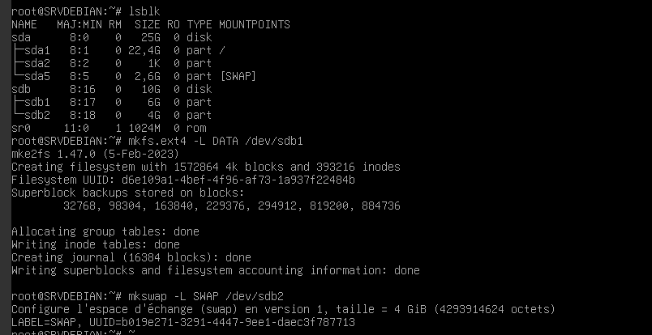
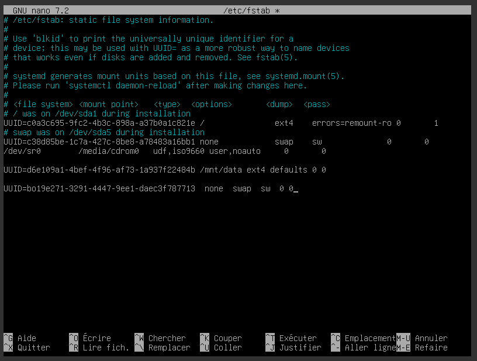
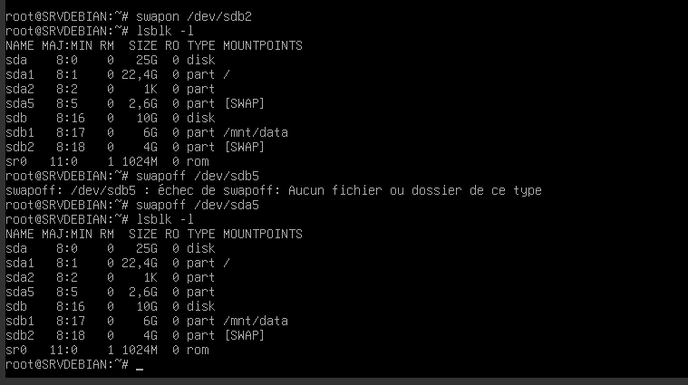
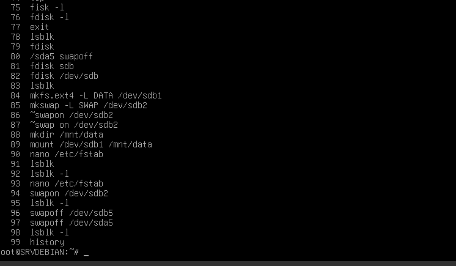

# CheckPoint1

## Exercice 1 : debian et partitions

Comme demandé voici les preuves pour valider cette partie.

## Exercice 2 : script

## Exercice 3 : questions 

**Donne une ligne de commande bash qui permet de lister la liste des utilisateurs d'un système Linux :**
 - cat etc/passwd

**Quelle commande bash permet de changer les droits du fichier myfile en rwxr—r-- ?**
 - chmod 744 myfile

**Comment faire pour que les fichiers pdf d'un dépôt local git ne soient pas pris en compte lors d'un git push ?**
 - Il faut créer un fichier ".gitignore".
 - L'éditer pour que les fichier ".pdf" ne soit pas pris en compte :
   #ignorer fichier pdf
   *.pdf
 - Et pour finir ajouter ce fichier a git avec : _git add .gitignore_

**Quelles commandes git utiliser pour fusionner les branches main et test_valide ?**
 - Pour fusionner il faut utiliser _merge_.
 - Tout d'abord utiliser _git checkout test_valide_
 - Puis utiliser commande _git merge main_

**Donne la(les) ligne(s) de commande(s) bash pour afficher le texte suivant :**
Malgré le prix élevé de 100$, il a dit "Bonjour !" au vendeur :
- "Bonjour est-ce que ce clavier fonctionne bien ?"
- "Evidemment ! On peut tout écrire avec, que ce soit des pipe | ou bien des backslash \\ !"
- "Même des tildes ~ ?"
- "Evidemment !"

=> echo -e "Malgré le prix élevé de 100$, il a dit '"Bonjour !"' au vendeur :/n
- '"Bonjour est-ce que ce clavier fonctionne bien ?"'/n
- '"Evidemment ! On peut tout écrire avec, que ce soit des pipe | ou bien des backslash \\ !"'/n
- '"Même des tildes ~ ?"'/n
- '"Evidemment !"'

**La commande jobs -l donne le résultat ci-dessous :**
wilder@Ubuntu:~$ jobs -l
[1]  37970 En cours d'exécution   gedit &
[2]  37971 En cours d'exécution   xeyes &
[3]- 37972 En cours d'exécution   sleep
Quelle commande te permet de mettre en avant le processus gedit ?
 - 

**7. Quels matériels réseaux sont sur la couche 2 et la couche 3 du modèle OSI ? Donne leurs spécificités.**
**8. Quels sont les équivalent PowerShell des commandes bash cd, cp, mkdir, ls.**
**9. Dans la trame ethernet, qu'est-ce que le payload ?**
**10. Pourquoi les classes IP sont remplacées par le CIDR ?**
